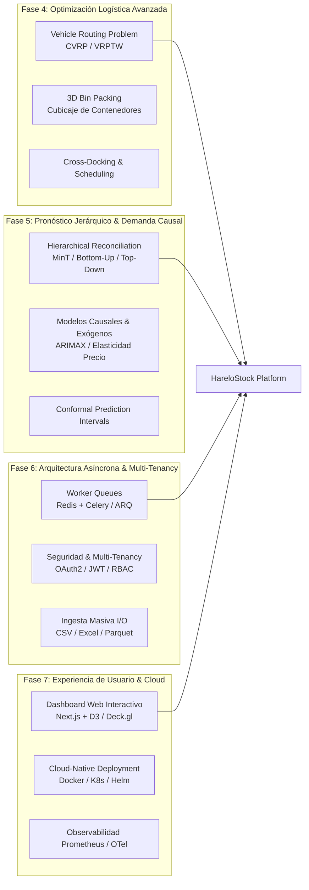

# Roadmap de Evolución y Escalabilidad Estratégica — HareloStock

Este documento traza la visión técnica, científica, arquitectónica y de producto para la evolución continua de **HareloStock**, consolidándolo como una plataforma integral de **Supply Chain Analytics, Prescriptive Optimization y Operaciones Logísticas Inteligentes**.

---

## 1. Resumen de Capacidades Consolidadas (Fases 1, 2 y 3)

| Eje Científico / Operativo | Módulos y Modelos Implementados | Endpoint Principal |
| :--- | :--- | :--- |
| **Inventario Estocástico** | Lead time estocástico ($\sigma_{DL}$ Silver-Pyke-Peterson), Inversión Normal Loss $G(k)$ para Fill Rate Tipo 2 | `POST /api/v1/inventory/analyse` |
| **Dimensionamiento Dinámico** | Wagner-Whitin (Programación Dinámica exacta), Silver-Meal, Least Unit Cost, Part-Period Balancing | `POST /api/v1/inventory/lot-sizing` |
| **Pronósticos Avanzados** | Holt-Winters (Triple ES aditivo/multiplicativo), Auto-Forecast por $\text{AIC}_c$, Croston, SBA, TSB, Matriz SBC | `POST /api/v1/forecast/auto`<br/>`POST /api/v1/forecast/holt-winters` |
| **Simulación Estocástica** | Monte Carlo multi-período con ajuste y muestreo de distribuciones (Normal, Poisson, Gamma, Log-Normal) vía KS-Test | `POST /api/v1/simulation/monte-carlo` |
| **Optimización de Redes (MILP)** | Localización capacitada de plantas/CDs y transporte óptimo con solver HiGHS (`scipy.optimize.milp`) | `POST /api/v1/optimization/network-flow` |
| **Multi-Eslabón (MEIO)** | Guaranteed Service Model (GSM), reducción de varianza por Risk Pooling y medición del Efecto Látigo | `POST /api/v1/inventory/multi-echelon` |
| **Decisión Multicriterio** | Analytical Hierarchy Process (AHP) con Consistency Ratio ($CR$) e inversión de criterios | `POST /api/v1/decision/ahp` |
| **Workspace Persistente** | 13 motores de cálculo, inmutabilidad SHA-256, snapshots de ejecución y resultados reproducibles | `POST /api/v1/scenarios/{id}/runs` |

---

## 2. Fases de Evolución Futura



---

## 3. Detalle de Módulos Sugeridos

### Fase 4: Optimización Logística Avanzada (Transporte y Almacén)

1. **Ruteo de Vehículos (Capacitated Vehicle Routing Problem - CVRP / VRPTW)**:
   - **Objetivo**: Planificar las rutas óptimas para flotas de distribución de última milla minimizando la distancia y el costo total de combustible.
   - **Restricciones**: Capacidad máxima de carga por vehículo (peso/volumen), ventanas de tiempo de entrega (*Time Windows*) en clientes y horarios de jornada laboral de conductores.
   - **Enfoque algorítmico**: Metaheurísticas de gran escala (ALNS - *Adaptive Large Neighborhood Search*, Simulated Annealing) o formulaciones exactas con generación de columnas.

2. **Empaquetado y Cubicaje 3D (*3D Bin Packing / Container Loading*)**:
   - **Objetivo**: Optimizar la colocación de cajas y pallets dentro de camiones o contenedores marítimos de 20'/40' para maximizar la utilización volumétrica y respetar límites de peso por eje.
   - **Algoritmos**: Heurísticas *Maximal Rectangles 3D*, *Guillotine Placement* y algoritmos genéticos espaciales.

---

### Fase 5: Pronósticos Jerárquicos y Factores Causales

1. **Reconciliación Jerárquica de Pronósticos (*Hierarchical Forecasting*)**:
   - **Objetivo**: En cadenas de suministro reales, los pronósticos se realizan a múltiples niveles: SKU $\rightarrow$ Marca $\rightarrow$ Categoría $\rightarrow$ Centro de Distribución $\rightarrow$ País.
   - **Métodos**:
     - *Bottom-Up* (suma desde el nivel más granular).
     - *Top-Down* (desagregación histórica de proporciones).
     - **Reconciliación Óptima MinT (Minimum Trace)**: Ajuste estadístico por mínimos cuadrados generalizados que garantiza coherencia matricial exacta minimizando la varianza del error.

2. **Modelado de Elasticidad Precio y Promociones (ARIMAX / ML)**:
   - Modelado de impacto de promociones, descuentos y variables meteorológicas/estacionales externas en la curva de demanda $d(p) = a \cdot p^{-\epsilon}$.

3. **Intervalos de Confianza Distribucionales (Conformal Prediction)**:
   - Cuantificación rigurosa de incertidumbre sin asumir normalidad para dimensionamiento de inventario a percentiles extremos ($p_{99}$).

---

### Fase 6: Infraestructura Enterprise, Asincronía e Ingesta Masiva

1. **Motor de Ejecución Asíncrono (*Task Queues*)**:
   - Para corridas de optimización MILP complejas o simulaciones de más de 10,000 SKUs, implementar un broker (Redis) y workers distribuidos (Celery / ARQ / FastAPI Background Tasks).
   - Patrón `POST /api/v1/scenarios/{id}/runs` $\rightarrow$ Retorna `202 Accepted` con `task_id` y pooling de estado o notificaciones por WebSockets.

2. **Seguridad, Autenticación y Multi-Tenancy (RBAC)**:
   - Autenticación mediante tokens JWT (OAuth2 Password Bearer) o API Keys.
   - Aislamiento de datos a nivel de base de datos (`tenant_id`, `organization_id`) para soportar despliegues SaaS multi-empresa.

3. **Ingesta y Exportación Masiva de Datos (*Batch File I/O*)**:
   - Endpoints multipart para cargar archivos directamente desde ERPs (SAP, Oracle, NetSuite) en formatos `.csv`, `.xlsx` o Apache `.parquet`.
   - Generación de reportes ejecutivos descargables en Excel y PDF con gráficos de reabastecimiento y órdenes de compra sugeridas.

---

### Fase 7: Visualización Interactiva y Ecosistema Cloud-Native

1. **Dashboard Web Interactivo (Frontend React / Next.js)**:
   - Mapa geoespacial de la red de suministro con visualización de flujos de carga y rutas de transporte (Deck.gl / Mapbox / Leaflet).
   - Tableros interactivos de matrices ABC/XYZ, análisis de inventario y curvas de demanda.

2. **Infraestructura Cloud y Despliegue Automatizado**:
   - `Dockerfile` multi-stage ligero para Python 3.13.
   - `docker-compose.yml` completo con API + PostgreSQL + Redis + Worker + Nginx.
   - Charts de Kubernetes / Helm para despliegue horizontal auto-escalable (HPA).
   - Telemetría completa con Prometheus (`/metrics`) y OpenTelemetry.

---

## 4. Guía de Ejecución Rápida

```bash
# 1. Ejecutar la suite completa de 60 pruebas
python -m pytest -v

# 2. Iniciar el servidor local en modo desarrollo
uvicorn app.main:app --reload --port 8000

# 3. Explorar la documentación interactiva
# Swagger UI: http://127.0.0.1:8000/docs
# ReDoc:      http://127.0.0.1:8000/redoc
```
