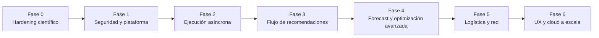

# Roadmap de evolución técnica — HareloStock

**Estado verificado:** 26 de agosto de 2026
**Propósito:** priorizar una plataforma de decisiones de inventario confiable antes de ampliar el catálogo de algoritmos.

## Principios de evolución

1. Una recomendación solo es útil si es trazable, reproducible y factible bajo restricciones reales.
2. Ningún modelo se promociona por novedad: debe superar baselines mediante backtesting sin fuga temporal y métricas operacionales.
3. La seguridad, el aislamiento de datos, la observabilidad y la ejecución controlada preceden a las funciones costosas o expuestas a clientes.
4. Las afirmaciones científicas deben describir exactamente el método implementado y sus supuestos.

## Capacidades actuales verificadas

| Área | Estado actual | Límites que deben conocerse |
|---|---|---|
| Inventario | EOQ, ROP, stock de seguridad con demanda y lead time variables, Fill Rate Tipo 2, ABC/XYZ. | Son modelos paramétricos de referencia; requieren unidades temporales coherentes y validación con datos reales. |
| Lot sizing | Wagner-Whitin, Silver-Meal, LUC, PPB y L4L. El costo total incluye compra, ordenar y mantener. | El costo unitario constante no cambia la política óptima; no hay MOQ, packs, capacidad ni presupuesto. |
| Pronóstico | SES, Holt, Holt-Winters, Croston/SBA/TSB y clasificación ADI–CV². | Auto-forecast usa AICc solo cuando es matemáticamente válido; aún falta backtesting rolling-origin para promover modelos. |
| Simulación | Monte Carlo con Normal, Poisson, Gamma y Log-Normal. | La selección automática minimiza distancia ECDF como heurística, no es una prueba formal de ajuste. Poisson solo acepta observaciones enteras. |
| Red logística | Localización capacitada y flujo de transporte MILP con HiGHS. | Solo las rutas declaradas son factibles; faltan multi-período, SLA, capacidad temporal y restricciones comerciales. |
| Multi-eslabón | Heurística coordinada de safety stock en un árbol validado. | No es un solver Guaranteed Service Model (GSM); supone demanda independiente y tiempos internos deterministas. El bullwhip es una aproximación teórica, no una medición observada. |
| Workspace | 13 motores, datasets inmutables con SHA-256, snapshots de solicitudes y resultados. | Sigue siendo síncrono, monotenancy y sin identidad/autorización. La versión de aplicación no sustituye un hash de código y dependencias. |

## Brechas que bloquean producción B2B

- No existen autenticación, RBAC ni aislamiento por organización.
- Los cálculos de simulación y MILP se ejecutan dentro de la solicitud HTTP; no hay colas, cancelación ni límites de tiempo por trabajo.
- El despliegue local usa SQLite y creación automática de tablas por defecto.
- Aún faltan contrato canónico de datos, ingesta controlada, backtesting, benchmarks académicos y observabilidad operativa.

## Secuencia recomendada

### Fase 0 — Hardening científico y calidad de ingeniería

**Objetivo:** que cada endpoint tenga contratos claros, errores controlados y pruebas que protejan las decisiones numéricas.

Avances incorporados:

- Validación de topología para MEIO y cálculo consistente de lead times acumulados.
- Rutas no declaradas prohibidas en el MILP; costos de carril duplicados rechazados.
- Costo de compra incluido en lot sizing.
- AICc nulo y exclusión de candidatos cuando la corrección no es válida.
- Selección de distribución documentada como heurística y Poisson limitado a conteos.
- Pruebas de regresión y `ruff` como controles de calidad.

Pendiente para cerrar la fase:

- Benchmarks contra casos publicados para inventario, forecast, MILP y lot sizing.
- Backtesting rolling-origin, baselines naive/seasonal naive y métricas WAPE, MASE, RMSSE, bias y cobertura.
- Model cards: alcance, supuestos, datos permitidos, métricas y límites de cada motor.
- Versionado de código y dependencias en cada ejecución, además de la versión de API.

**Gate de salida:** CI obligatorio, cobertura de fallos de dominio, benchmarks reproducibles y documentación de supuestos por motor.

### Fase 1 — Seguridad y plataforma de datos

**Objetivo:** preparar la API para información B2B sin exponer datos ni depender de configuración local.

- `organization_id` y políticas de aislamiento en todas las entidades y consultas.
- OIDC/JWT, service accounts, RBAC, auditoría e idempotency keys.
- PostgreSQL administrado, migraciones obligatorias, backups y secretos fuera del repositorio.
- CORS restrictivo por entorno, rate limits, cuotas y límites de tamaño/cómputo.
- Contenedores, CI/CD, escaneo de dependencias, logs estructurados, métricas y trazas.
- Modelo canónico de SKU, ubicación, proveedor, inventario, demanda, lead time y restricciones.

**Gate de salida:** prueba automatizada de no acceso cruzado entre organizaciones, restauración de backup validada y despliegue repetible en staging.

### Fase 2 — Ejecución asíncrona y gobierno de corridas

**Objetivo:** convertir cálculos pesados en trabajos observables, cancelables y con recursos controlados.

- Cola y workers (por ejemplo Redis + ARQ/Celery), estados `queued/running/succeeded/failed/cancelled` y timeouts.
- Límites por tenant, reintentos seguros, cancelación, registro de consumo y notificaciones.
- Resultados grandes en object storage y metadatos en PostgreSQL.
- Versionado de dataset, motor, código, entorno y semilla para reproducibilidad real.

**Gate de salida:** una simulación o MILP grande no bloquea la API ni una corrida de otro tenant.

### Fase 3 — Producto de recomendaciones y pilotos

**Objetivo:** cerrar el ciclo dato → recomendación → aprobación → resultado.

- Carga CSV/Excel con validación, mapeo, reporte de calidad y datasets inmutables.
- Políticas ROP, `(s,Q)`, `(R,S)`, base-stock y newsvendor con MOQ, pack size, presupuesto y calendario.
- Recomendación explicable: acción, cantidad, costo, riesgo, restricciones, alternativas y fuente de datos.
- Workflow de aprobación, modificación/rechazo con motivo, ejecución y valor observado.
- Modo sombra, comparación contra planner y dashboard de ROI para design partners.

**Gate de salida:** cada recomendación tiene linaje completo y su impacto se puede comparar contra un baseline acordado.

### Fase 4 — Forecast y optimización avanzada, por evidencia

**Objetivo:** mejorar decisiones, no añadir modelos por catálogo.

- Forecast jerárquico: bottom-up, top-down y MinT.
- Variables causales y promociones: primero datos, luego regresión/elasticidad y evaluación causal.
- Intervalos conformales y cuantiles calibrados.
- ML global como challenger (LightGBM/CatBoost/XGBoost con lags y covariables).
- MILP multi-período, escenarios, restricciones robustas y optimización bajo incertidumbre.
- Multi-echelon real solo con una formulación validada (GSM/METRIC), supuestos explícitos y benchmark independiente.

**Gate de salida:** cada challenger supera al champion en métricas predictivas y operacionales, dentro de un SLA de costo y latencia.

### Fase 5 — Logística y red

**Objetivo:** extender decisiones de abastecimiento al transporte sin adelantar complejidad.

- CVRP/VRPTW y planificación de rutas solo después de disponer de flota, ventanas y restricciones fiables.
- Cubicaje/3D bin packing, cross-docking y scheduling como módulos separados con restricciones físicas verificables.
- Digital twin y simulación de eventos discretos cuando exista un grafo de red y datos operacionales completos.

### Fase 6 — Experiencia, integraciones y cloud a escala

**Objetivo:** hacer el producto usable y operable para múltiples clientes.

- Dashboard web de excepciones, decisiones, escenarios y resultados; no solo visualización de métricas.
- Conectores priorizados por evidencia de clientes, webhooks y exportaciones controladas.
- Kubernetes/Helm y autoescalado únicamente cuando la carga y el aislamiento lo justifiquen.
- Observabilidad de producto: SLA, costo por tenant, latencia, errores y calidad de recomendación.

## Criterios permanentes de priorización

Una iniciativa entra solo si reduce riesgo de seguridad u operación, mejora la calidad/calibración de una decisión, hace factible una recomendación bajo restricciones reales, disminuye el tiempo de integración o demuestra valor económico para un cliente.
