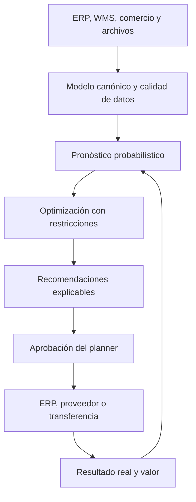
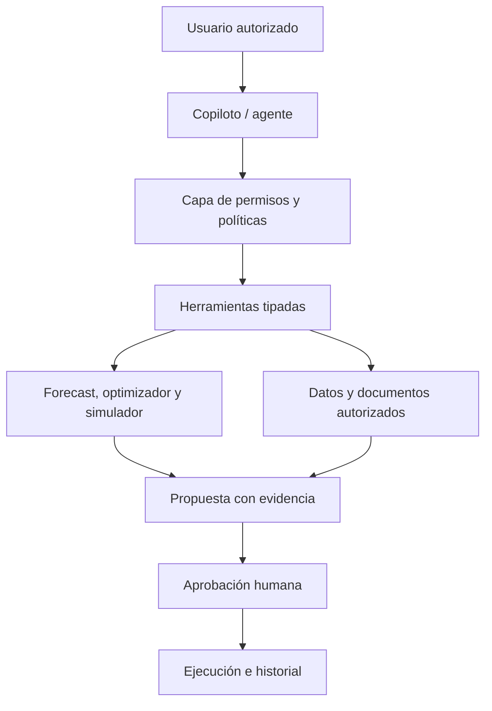

# HareloStock — Roadmap final de producto, algoritmos y comercialización

**Versión:** 1.1  
**Fecha:** 26 de agosto de 2026  
**Horizonte inicial:** 12 meses para lanzamiento y escalamiento; 24 meses para plataforma avanzada  
**Estrategia principal:** B2B; una versión self-service podrá explorarse después como canal B2B2C/B2B para comercios pequeños.

---

## 1. Resumen ejecutivo

HareloStock debe evolucionar de una API de cálculos supply-chain a una **capa de inteligencia de decisiones de inventario y abastecimiento**. Su trabajo no terminará al producir un pronóstico: deberá convertir datos operativos en una recomendación explicable, permitir su aprobación, registrar la ejecución y medir el resultado económico.

La propuesta de valor inicial será:

> **HareloStock conecta los datos operativos de una empresa y recomienda qué comprar, cuánto, cuándo y desde dónde, optimizando simultáneamente nivel de servicio, margen y capital de trabajo. Cada recomendación conserva sus datos, supuestos, restricciones, versión y resultado.**

El lanzamiento no esperará a tener una suite end-to-end. El producto debe salir en cuatro niveles:

1. **Prototipo validado:** problema, datos y comprador confirmados.
2. **MVP seguro:** sistema demostrable con recomendaciones trazables.
3. **Piloto pagado:** decisiones reales en modo sombra y luego bajo aprobación humana.
4. **Disponibilidad general:** onboarding, seguridad, conectores y operación repetible.

Los algoritmos predictivos y prescriptivos comienzan desde el MVP. Los LLM y agentes se incorporan únicamente cuando existan clientes recurrentes, datos confiables, historial suficiente de decisiones y una economía sostenible. La IA generativa será una capa de interacción y orquestación; los cálculos críticos permanecerán en motores verificables.

### Estado de partida verificado

La API actual es un **baseline técnico y científico**, no todavía un producto B2B listo para producción. Cuenta con motores versionados, persistencia de escenarios, inventario, forecasting, simulación, lot sizing, MILP y análisis multi-eslabón. Antes del MVP comercial deben cerrarse los controles de la Fase 0 técnica: benchmarks reproducibles, backtesting sin fuga temporal, contratos de datos, CI obligatorio, seguridad, tenancy y ejecución asíncrona.

Las capacidades se comunican con el alcance exacto que hoy tienen: el selector automático de forecast usa AICc solo donde esa corrección es válida; la selección de distribuciones es una heurística de distancia ECDF; y el MEIO actual es una heurística coordinada, no un óptimo Guaranteed Service Model. Un MEIO GSM/METRIC validado sigue siendo trabajo futuro de la Fase 3.

---

## 2. Decisiones estratégicas que no deben cambiar durante el primer año

### 2.1 Segmento inicial

Priorizar distribuidores, importadores, retail o e-commerce omnicanal que tengan:

- Entre 1.000 y 50.000 SKU.
- Dos o más ubicaciones o centros de distribución.
- Históricos de venta e inventario disponibles.
- Reposición operada total o parcialmente en Excel.
- ERP, WMS o plataforma de comercio existente, pero poca inteligencia de planificación.
- Problemas visibles de stockout, exceso, compras urgentes o baja rotación.

Se debe escoger **una vertical inicial**. Buenos candidatos son repuestos, distribución industrial, ferretería, belleza, farmacia no regulada y productos no perecederos.

### 2.2 Caso de uso inicial

El flujo central será:



### 2.3 Lo que no se construirá al inicio

- Un ERP, WMS o TMS nuevo.
- Una control tower genérica.
- Planificación detallada de producción.
- Optimización de rutas de transporte.
- Digital twin completo.
- LLM como calculadora de inventario.
- Agentes con autoridad autónoma para emitir compras.
- Aplicación B2C separada.
- Decenas de conectores antes de validar cuáles utiliza el mercado inicial.

---

## 3. Qué significa “algoritmos de punta” para HareloStock

Ser de punta no significa utilizar siempre el modelo más grande. Significa disponer de un sistema que:

1. Selecciona el algoritmo adecuado para cada patrón de demanda.
2. Compara todo modelo contra baselines simples y fuertes.
3. Pronostica distribuciones y riesgos, no únicamente promedios.
4. Optimiza decisiones bajo restricciones comerciales reales.
5. Aprende del resultado posterior a cada recomendación.
6. Detecta degradación, cambios de régimen y datos deficientes.
7. Puede explicar por qué una política fue recomendada.
8. Reproduce exactamente cada decisión histórica.

La ventaja competitiva no será un algoritmo aislado. Será el sistema combinado:

```text
datos confiables
→ segmentación
→ ensemble predictivo
→ incertidumbre calibrada
→ optimización prescriptiva
→ simulación
→ aprobación
→ resultado observado
→ aprendizaje
```

---

## 4. Inventario algorítmico por fase

### 4.1 Matriz principal

| Capacidad | Algoritmos o métodos | Fase | Papel en el producto |
|---|---|---:|---|
| Baselines | Naive, seasonal naive, media móvil | 0–1 | Piso obligatorio para demostrar mejora real |
| Estadísticos clásicos | SES, Holt, Holt-Winters/ETS, Theta, AutoARIMA | 1 | Modelos locales robustos, explicables y económicos |
| Segmentación de demanda | ABC/XYZ, ADI–CV², ciclo de vida y velocidad | 1 | Enrutar cada SKU a la familia de modelos adecuada |
| Demanda intermitente | Croston, SBA, TSB, ADIDA, IMAPA | 1 | Repuestos y referencias con muchos ceros |
| Incertidumbre inicial | Bootstrap de residuales, cuantiles empíricos, conformal split/rolling | 1 | P50/P80/P90 e intervalos calibrados |
| Reposición básica avanzada | ROP con demanda y lead time variables, base-stock, `(s,Q)`, `(R,S)`, newsvendor | 1 | Recomendaciones costo-servicio por SKU-localización |
| Simulación realista | Bootstrap empírico, Poisson, negative binomial, demanda censurada y lead time empírico | 1–2 | Evaluar políticas sin asumir siempre normalidad |
| ML global tabular | LightGBM/CatBoost/XGBoost con lags, calendarios, precios, promociones y covariables | 2 | Aprender entre miles de SKU y usar señales externas |
| Forecast probabilístico ML | Quantile regression, Tweedie/Poisson objectives, conformal adaptativo | 2 | Distribuciones útiles para optimización y riesgo |
| Ensembles/AutoForecast | Selección por rolling-origin, combinación ponderada y stacking controlado | 2 | Evitar dependencia de un único modelo |
| Forecast jerárquico | Bottom-up, top-down y reconciliación MinT | 2 | Coherencia SKU–categoría–ubicación–empresa |
| Optimización de reposición | MILP multi-periodo, restricciones MOQ/pack/capacidad/presupuesto | 2 | Producir órdenes y transferencias factibles |
| Optimización bajo incertidumbre | Sample Average Approximation, chance constraints y optimización robusta | 2–3 | Balancear riesgo, servicio y costo |
| Redes neuronales globales | N-HiTS, DeepAR, TFT, PatchTST o TiDE como challengers | 3 | Capturar relaciones complejas solo si los datos lo justifican |
| Foundation models de series | TimesFM, Chronos/Chronos-2 u otros, siempre como challengers | 3 | Zero/few-shot y cold start, sujetos a benchmark interno |
| Promociones y causalidad | Causal impact, double ML, synthetic controls o uplift | 3 | Separar correlación de efecto promocional |
| Multi-echelon | METRIC/aproximaciones, service allocation y optimización estocástica | 3 | Inventario coordinado entre red y ubicaciones |
| Riesgo operacional | Change-point detection, drift, anomaly detection, survival/hazard de lead time | 2–3 | Anticipar rupturas de demanda y proveedor |
| Digital twin de red | Graph/network flow, BOM, capacidad y simulación de eventos discretos | 4 | Planificación end-to-end y escenarios de red |
| Decisión secuencial | MPC y, solo como challenger, offline/constrained RL | 4–5 | Políticas adaptativas con simulador validado y límites duros |
| IA generativa | RAG, tool calling, resumen y explicación | 3 | Copiloto del planner; nunca fuente numérica autoritativa |
| Agentes supervisados | Monitoreo, preparación de escenarios y propuestas de acción | 4 | Orquestación con aprobación, permisos y auditoría |

### 4.2 Qué ocurre con los algoritmos que ya existen

| Componente actual | Decisión |
|---|---|
| ABC/XYZ | Conservar como segmentación básica; añadir ADI–CV², margen, criticidad y ciclo de vida |
| EOQ/Wilson | Conservar como baseline y explicación educativa; no usar como política universal |
| Safety stock normal | Conservar como baseline; sustituir gradualmente por cuantiles calibrados y lead time variable |
| SES/Holt | Conservar dentro del catálogo clásico y del benchmark |
| Monte Carlo normal | Rehacer como motor configurable de escenarios y distribuciones empíricas/discretas |
| Auto-forecast por AICc | Mantener como selector exploratorio; promover modelos solo con rolling-origin y AICc matemáticamente válido |
| MEIO heurístico | Mantener como análisis experimental de seguridad de stock; no presentar como GSM hasta validar una formulación optimizada |
| MILP de red | Conservar para escenarios estáticos con carriles declarados; ampliar después a restricciones temporales y comerciales |
| Optimización por incremento porcentual | Reemplazar por búsqueda costo-servicio y luego por MILP/optimización estocástica |
| AHP | Conservar para decisiones estratégicas explícitas; no utilizar como motor principal de reposición |
| Escenarios y runs persistentes | Convertir en núcleo de gobernanza, versionado y trazabilidad del producto |

---

## 5. Protocolo obligatorio para aceptar un algoritmo

Ningún modelo se declara “mejor” por reputación o novedad. Todo candidato deberá atravesar:

1. **Rolling-origin backtesting** sin fuga temporal.
2. Evaluación por SKU, segmento, horizonte, ubicación y ciclo de vida.
3. Comparación contra naive, seasonal naive y modelo en producción.
4. Métricas de punto: WAPE, MASE, RMSSE y bias.
5. Métricas probabilísticas: pinball loss, cobertura, ancho del intervalo, Winkler/CRPS cuando aplique.
6. Métricas operacionales: fill rate, stockout, costo total, inventario, margen y capital.
7. Prueba de estabilidad, latencia, costo de cómputo y reproducibilidad.
8. Champion–challenger antes de promoción.
9. Aprobación automática únicamente si supera umbrales predefinidos.
10. Rollback inmediato si aparece degradación.

La función objetivo final no será únicamente minimizar error de forecast:

\[
\min \left(
C_{inventario} +
C_{stockout} +
C_{ordenar} +
C_{urgencia} +
C_{obsolescencia}
\right)
\]

sujeta a nivel de servicio, MOQ, múltiplos, capacidad, presupuesto, calendarios, lead time y reglas empresariales.

---

## 6. Arquitectura de la fuente de decisiones

HareloStock debe convertirse en el **system of intelligence** y en el registro de decisiones, sin intentar reemplazar al ERP como system of record transaccional.

### 6.1 Entidades mínimas

- Organización, usuario, rol y permisos.
- Producto/SKU y jerarquías.
- Ubicación y red logística.
- Proveedor y acuerdos.
- Demanda observada, ventas perdidas estimadas y promociones.
- Inventario disponible, comprometido, en tránsito y backlog.
- Órdenes, recepciones y cancelaciones.
- Lead time observado y prometido.
- Restricciones: MOQ, pack size, capacidad, presupuesto y calendario.
- Dataset versionado.
- Forecast con cuantiles y versión del modelo.
- Política de inventario.
- Escenario.
- Recomendación.
- Explicación y supuestos.
- Aprobación, modificación o rechazo.
- Acción ejecutada.
- Resultado observado y valor realizado.

### 6.2 Contrato de una recomendación

Cada recomendación debe responder:

- ¿Qué acción se propone?
- ¿Para qué SKU, ubicación y fecha?
- ¿Qué cantidad y costo implica?
- ¿Qué objetivo optimiza?
- ¿Qué restricciones respetó?
- ¿Cuál es el riesgo si se ejecuta o no se ejecuta?
- ¿Qué forecast y distribución utilizó?
- ¿Qué alternativas se evaluaron?
- ¿Qué versión de datos, código y modelo la produjo?
- ¿Quién aprobó, modificó o rechazó?
- ¿Qué ocurrió realmente después?

Ejemplo:

```json
{
  "decision_type": "purchase_order_recommendation",
  "sku_id": "SKU-1425",
  "location_id": "BOG-01",
  "recommended_quantity": 780,
  "recommended_order_date": "2026-09-14",
  "forecast_quantile": "P80",
  "stockout_probability_without_action": 0.72,
  "expected_inventory_cost": 4100,
  "expected_margin_protected": 18400,
  "constraints_applied": ["MOQ=300", "pack_size=12", "budget"],
  "status": "pending_approval",
  "dataset_version": "...",
  "model_version": "...",
  "optimizer_version": "..."
}
```

### 6.3 Componentes técnicos

- API transaccional y API de decisiones.
- PostgreSQL para metadatos y operaciones.
- Almacenamiento de objetos para datasets y resultados grandes.
- Cola de trabajos y workers para forecast, simulación y optimización.
- Feature store lógico, inicialmente simple y versionado.
- Model registry y experiment tracking.
- Servicio de backtesting.
- Servicio de optimización.
- Event log/audit log inmutable.
- Webhooks y conectores de salida.
- Observabilidad: logs, métricas, trazas, costos y SLAs.
- Ambientes dev, staging y production.

---

## 7. Roadmap de ejecución

## Fase 0 — Validación y diseño del producto

**Duración:** semanas 1–4  
**Objetivo:** validar problema, datos, comprador y vertical antes de ampliar el código.

### Producto y mercado

- Entrevistar 15–20 empresas.
- Conseguir datasets reales de al menos tres empresas.
- Documentar el flujo actual de planificación y reposición.
- Escoger una vertical y un caso de uso.
- Identificar comprador, usuario, aprobador y área de TI.
- Definir baseline económico y calculadora de ROI.
- Conseguir dos o tres design partners.

### Algoritmos

- Cerrar hardening de contratos científicos: validación de topologías, rutas factibles, costos completos y casos límite de información estadística.
- Añadir benchmarks reproducibles de cada motor contra casos publicados y datasets de referencia.
- Congelar el comportamiento actual como baseline versionado.
- Implementar harness de backtesting rolling-origin.
- Añadir naive y seasonal naive.
- Definir catálogo de métricas y segmentación de demanda.
- Ejecutar el motor actual sobre datasets reales para descubrir fallos de supuestos.
- No entrenar deep learning ni foundation models.

### Datos

- Definir modelo canónico.
- Crear diccionario de datos y reglas de calidad.
- Identificar datos ausentes y datos censurados por stockout.
- Determinar granularidad y horizonte de planificación.

### Gate de salida

- Tres empresas entregan datos.
- Dos aceptan pilotear.
- Existe un comprador identificado.
- El problema tiene impacto económico medible.
- Se define el KPI principal del piloto.

---

## Fase 1 — MVP seguro y motor de decisiones inicial

**Duración:** semanas 5–12  
**Objetivo:** producir recomendaciones confiables y trazables en un entorno B2B seguro.

### Plataforma

- Multi-tenancy mediante `organization_id` en todas las entidades.
- Autenticación OIDC/JWT, service accounts y RBAC.
- Aislamiento de datos y audit trail.
- PostgreSQL, migraciones controladas y backups.
- Ejecución asíncrona con colas, workers, retries, timeouts y cancelación.
- Idempotency keys, rate limits y cuotas.
- CI/CD, contenedores, pruebas y escaneo de dependencias.
- Logs estructurados, métricas, trazas y seguimiento de errores.

### Ingesta

- CSV/Excel con plantilla, mapeo y validación.
- Reporte de calidad y errores accionables.
- Historial de cargas y datasets inmutables.
- Primer conector seleccionado por evidencia de los design partners.

### Algoritmos obligatorios desde el MVP

1. **Segmentación:** ABC/XYZ + ADI–CV² + ciclo de vida.
2. **Baselines:** naive y seasonal naive.
3. **Clásicos:** ETS/Holt-Winters, Theta y AutoARIMA.
4. **Intermitentes:** Croston, SBA y TSB; ADIDA/IMAPA como challengers.
5. **Evaluación:** rolling-origin y selección por SKU/segmento/horizonte.
6. **Incertidumbre:** cuantiles por bootstrap/conformal inicial.
7. **Inventario:** ROP con demanda y lead time variables, base-stock, `(s,Q)`, `(R,S)` y newsvendor.
8. **Simulación:** demanda empírica, Poisson/negative binomial cuando aplique y lead time empírico.
9. **Costo-servicio:** curva de políticas alternativas y recomendación factible con MOQ/pack size.

### Interfaz

- Bandeja de excepciones.
- Forecast P50/P80/P90.
- Orden/transferencia sugerida.
- Riesgo de stockout.
- Costo y margen esperado.
- Explicación y supuestos.
- Aprobar, modificar o rechazar.
- Exportación controlada.

### Gate de salida

- Cero acceso cruzado entre organizaciones.
- Backtesting reproducible y sin fuga temporal.
- Dataset objetivo procesado dentro del SLA.
- Cada recomendación tiene linaje completo.
- Demo end-to-end sin intervención técnica.
- Primer design partner listo para modo sombra.

---

## Fase 2 — Pilotos pagados y optimización operacional

**Duración:** semanas 13–20  
**Objetivo:** demostrar ROI real y convertir recomendaciones en procesos repetibles.

### Ejecución del piloto

1. Integración y calidad de datos.
2. Operación en modo sombra.
3. Comparación contra decisiones del planner.
4. Activación bajo aprobación humana.
5. Medición de resultado contra baseline.

### Algoritmos

- LightGBM/CatBoost/XGBoost global con lags y covariables.
- Objetivos quantile, Poisson, Tweedie o negative binomial según el patrón.
- Ensembles y champion–challenger.
- Conformal adaptativo para mejorar calibración.
- Reconciliación jerárquica MinT.
- Detección de anomalías, drift, bias y cambio de régimen.
- Modelo probabilístico/empírico de lead time por proveedor.
- MILP multi-periodo para órdenes y transferencias.
- Restricciones: MOQ, pack, calendario, capacidad, presupuesto y órdenes abiertas.
- Optimización por escenarios mediante Sample Average Approximation.

### Producto

- Workflow de aprobaciones.
- Razón de modificación o rechazo.
- Recomendado vs. aprobado vs. ejecutado.
- Valor proyectado vs. valor realizado.
- Notificaciones y webhooks.
- Supplier performance básico.
- Comparación de escenarios.

### Comercial

- Piloto pagado de 8–12 semanas.
- Fee de implementación más suscripción.
- Baseline y método de medición acordados.
- Conversión predefinida a contrato anual.
- Caso de éxito sujeto a autorización.

### Gate de salida

- Dos pilotos pagados.
- Uno convertido a contrato anual.
- ROI demostrado en al menos un KPI operacional.
- Implementación repetible en menos de tres semanas.
- Más del 50% de recomendaciones aceptadas o modificadas con razón conocida.
- Operación sin soporte diario del fundador.

---

## Fase 3 — Disponibilidad general y ML avanzado

**Duración:** meses 6–8  
**Objetivo:** lanzar un producto repetible y probar modelos avanzados solo donde agreguen valor.

### Producto empresarial

- Onboarding guiado.
- Suscripciones, consumo y facturación.
- SSO empresarial y service accounts.
- SLA, página de estado y soporte.
- DPA, privacidad, retención y eliminación.
- Preparación SOC 2/ISO 27001.
- API pública y conectores productizados.
- Escenarios de demanda, suministro y promociones.
- Transferencias multiubicación.

### Algoritmos avanzados como challengers

- N-HiTS para forecasting global y horizontes largos.
- DeepAR para distribuciones probabilísticas globales.
- TFT cuando existan covariables relevantes y necesidad de interpretación.
- PatchTST o TiDE para series multivariadas con suficiente volumen.
- TimesFM y Chronos/Chronos-2 como challengers zero/few-shot.
- Métodos causales para promociones y cambios de precio.
- Forecast de productos nuevos por atributos y productos análogos.
- Multi-echelon inventory optimization inicial.

Ninguno sustituirá automáticamente al ensemble de producción. Deberá demostrar mejora en métricas operacionales, calibración, costo y latencia.

### Primera incorporación de LLM

El LLM puede entrar aquí únicamente si se cumplen los gates de la sección 8. Sus primeras funciones serán:

- Consultas en lenguaje natural sobre KPIs y decisiones.
- Resumen de excepciones y cambios.
- Explicación de recomendaciones usando resultados estructurados.
- RAG sobre políticas, contratos, SOPs y documentación aprobada.
- Ayuda para configurar escenarios.
- Borradores de comunicación a proveedores, siempre sujetos a aprobación.

No podrá:

- Inventar cifras.
- Calcular cantidades autoritativas sin invocar motores deterministas.
- Saltarse restricciones.
- Aprobar o ejecutar órdenes.
- Consultar datos de otro tenant.

### Gate de salida

- 5–10 clientes pagados.
- Uso semanal recurrente.
- Retención o intención de renovación demostrable.
- Onboarding estándar inferior a dos semanas.
- Modelos avanzados superan baselines donde son promovidos.
- LLM evaluado con casos de prueba, permisos, trazabilidad y fallback.

---

## Fase 4 — Escalamiento y orquestación supervisada

**Duración:** meses 9–12  
**Objetivo:** ampliar red, automatización y distribución comercial sin perder control.

### Algoritmos

- Multi-echelon completo por familias de producto.
- Asignación de inventario escaso y fair-share optimizado.
- Optimización conjunta de órdenes, transferencias y capacidad.
- Optimización robusta y chance constraints.
- Survival/hazard models para lead time y riesgo proveedor.
- Forecast jerárquico probabilístico.
- Modelos de sustitución y canibalización.
- Causalidad de promociones y precio productizada.
- Simulación de eventos discretos de la red.

### Agentes supervisados

- Monitorear eventos y excepciones.
- Recopilar datos relevantes.
- Invocar forecast, optimización y simulación mediante herramientas tipadas.
- Preparar escenarios alternativos.
- Redactar la justificación.
- Crear una propuesta de acción.
- Enviar la propuesta a aprobación.

Toda acción conservará permisos, límites monetarios, logs, idempotencia y aprobación humana. El agente no será la fuente de verdad matemática.

### Negocio

- Paquetes por vertical.
- Customer success con revisión trimestral de valor.
- Contratos anuales y expansión dentro de cuentas.
- Partners de implementación ERP/supply-chain.
- Plan enterprise con SSO, SLA y opciones de aislamiento.
- Estrategia regional LATAM y posterior expansión.

### Gate de salida

- Retención saludable.
- Economía unitaria conocida.
- Implementaciones repetibles por partners.
- Expansión de uso dentro de clientes.
- Automatización supervisada con incidentes dentro del umbral acordado.

---

## Fase 5 — Plataforma avanzada de supply-chain

**Horizonte:** año 2  
**Objetivo:** evolucionar hacia planificación concurrente y digital twin sin perder el foco económico.

### Capacidades

- Grafo de red y conocimiento supply-chain.
- BOM multinivel.
- Capacidades, calendarios y restricciones de producción.
- Network flow, sourcing y asignación global.
- Simulación de disrupciones.
- Optimización estocástica multi-etapa.
- Model Predictive Control.
- Offline/constrained reinforcement learning únicamente con simulador validado.
- Integrated Business Planning.
- Colaboración con proveedores.
- Agentes con niveles de autonomía configurables y reversibles.

---

## 8. Gates para introducir LLM e IA generativa

La IA generativa no se habilitará por fecha, sino por madurez. Se requiere:

### Gate comercial

- Mínimo 5–10 clientes pagados.
- Clientes recurrentes y señales claras de renovación.
- Flujo comercial sostenible.
- Caso de uso que reduzca trabajo o mejore decisiones de forma medible.

### Gate de datos

- Modelo canónico estable.
- Calidad y linaje medidos.
- Historial de recomendaciones, aprobaciones y resultados.
- Documentación empresarial accesible con permisos.
- Separación de tenants probada.

### Gate operacional

- Motores numéricos versionados y accesibles mediante herramientas tipadas.
- RBAC, auditoría e idempotencia.
- Evaluaciones automáticas del LLM.
- Protección contra prompt injection y exfiltración.
- Respuestas con evidencia y enlaces a la fuente interna.
- Fallback sin LLM.
- Límites de costo y latencia.

### Gate de valor

- El caso de uso supera una alternativa determinista o una interfaz tradicional.
- Se mide tiempo ahorrado, adopción, exactitud de explicación y tasa de corrección humana.
- Los usuarios confían en el flujo sin confundir explicación con cálculo.

---

## 9. Arquitectura segura para LLM y agentes



Principios:

- El LLM interpreta intención; no realiza aritmética crítica.
- Los motores retornan JSON estructurado y validado.
- RAG recupera solo documentos autorizados por tenant y rol.
- Cada afirmación operacional debe enlazar su evidencia.
- Toda acción externa usa una herramienta explícita y permisos separados.
- Las acciones monetarias requieren aprobación y límites.
- Las evaluaciones cubren exactitud, groundedness, seguridad, permisos y consistencia.
- El sistema funciona aunque el proveedor LLM esté caído.

---

## 10. Datos y flywheel de aprendizaje

El activo estratégico será el historial de decisiones, no únicamente el histórico de ventas.

Por cada recomendación se debe capturar:

- Forecast disponible en el momento de decidir.
- Distribución y riesgo.
- Restricciones activas.
- Recomendación original.
- Cambios del planner y motivo.
- Decisión aprobada.
- Ejecución real.
- Resultado de demanda, inventario, servicio, margen y costo.
- Eventos externos relevantes.

Esto permitirá:

- Calibrar niveles de confianza.
- Aprender preferencias y reglas empresariales explícitas.
- Mejorar modelos por segmento.
- Detectar recomendaciones sistemáticamente modificadas.
- Medir valor realizado.
- Entrenar ranking o policy models en fases posteriores.

Los datos nunca se mezclarán entre clientes sin base contractual, controles de privacidad y una estrategia explícita de aprendizaje federado/anónimo.

---

## 11. MLOps y gobierno de modelos

Desde la Fase 1 deben existir:

- Versionado de datasets, features, modelos, optimizadores y código.
- Registro de experimentos.
- Model registry con estados candidate, challenger, champion y retired.
- Reentrenamiento reproducible.
- Backtesting automático.
- Drift de datos, concepto, bias y cobertura.
- Monitoreo de costo y latencia.
- Aprobación para promoción.
- Canary release y rollback.
- Model cards con alcance, supuestos, métricas y limitaciones.
- Auditoría de quién promovió un modelo.

Cadencia sugerida:

- Monitoreo diario de pipelines y calidad.
- Monitoreo semanal de bias y excepciones.
- Evaluación mensual por segmentos.
- Revisión trimestral de valor y políticas.
- Reentrenamiento por evidencia, no solo por calendario.

---

## 12. KPIs del producto

### Predictivos

- WAPE, MASE y RMSSE.
- Forecast bias.
- Pinball loss/CRPS.
- Cobertura y ancho de intervalos.
- Mejora frente a seasonal naive.

### Operacionales

- Fill rate y OTIF.
- Stockout rate.
- Inventory turns y días de inventario.
- Exceso y obsolescencia.
- Compras urgentes.
- Capital de trabajo liberado.
- Margen o ventas protegidas.

### Decisiones

- Recomendaciones aceptadas, modificadas y rechazadas.
- Motivos de modificación.
- Tiempo de excepción a decisión.
- Proyectado vs. realizado.
- Porcentaje de decisiones con evidencia completa.

### SaaS

- Tiempo de onboarding.
- Usuarios activos semanales.
- Retención y expansión.
- Ingreso recurrente.
- Costo de servir cada tenant.
- Incidentes y cumplimiento de SLA.

### LLM, cuando aplique

- Groundedness y exactitud factual.
- Tasa de corrección humana.
- Casos resueltos sin escalamiento.
- Tiempo ahorrado.
- Costo por interacción útil.
- Violaciones de permisos o políticas: objetivo cero.

---

## 13. Plan comercial asociado a las fases

| Fase | Oferta | Evidencia de compra |
|---|---|---|
| 0 | Diagnóstico y workshop | Acceso a datos y carta de intención |
| 1 | Demo sobre datos del cliente | Sponsor y acuerdo de piloto |
| 2 | Piloto pagado de 8–12 semanas | Fee, baseline y conversión definida |
| 3 | Suscripción anual | Renovación, uso recurrente y caso de éxito |
| 4 | Enterprise/expansión | Más ubicaciones, SKU, módulos y usuarios |

Modelo comercial inicial:

- Fee de implementación.
- Suscripción por banda de SKU/ubicaciones o volumen de decisiones.
- Plan enterprise por SLA, SSO, conectores y soporte.
- Descuento limitado para design partners.
- Medición de ROI incluida en el producto.

No se debe competir por ser la opción más barata. La venta debe anclarse al valor económico del inventario evitado, ventas protegidas y tiempo operativo reducido.

---

## 14. Equipo mínimo

### Hasta pilotos pagados

- Product/founder con conocimiento supply-chain.
- Backend/platform engineer.
- Data scientist/operations researcher.
- Frontend/product engineer.
- Apoyo parcial de DevOps/security y UX.

### Para disponibilidad general

- Customer success/implementation.
- Ventas B2B.
- Engineer de integraciones.
- Segundo perfil de plataforma o ML.
- Soporte legal/compliance.

El especialista en investigación operacional es tan importante como el perfil de ML. El forecast estima lo que puede pasar; la optimización decide qué hacer.

---

## 15. Cronograma consolidado de 12 meses

| Periodo | Producto | Algoritmos | Comercial |
|---|---|---|---|
| Mes 1 | Modelo canónico y diseño | Baselines y backtesting | Entrevistas y design partners |
| Meses 2–3 | MVP seguro y asíncrono | Clásicos, intermitentes, cuantiles, políticas iniciales | Demos con datos reales |
| Meses 4–5 | Aprobaciones y medición de valor | ML global, MinT, MILP, conformal adaptativo | Pilotos pagados |
| Meses 6–8 | GA, conectores y enterprise basics | Neural/foundation challengers, causalidad, multi-echelon inicial | 5–10 clientes y contratos anuales |
| Meses 9–12 | Escala y orquestación | Optimización robusta, red y agentes supervisados | Partners, expansión y verticalización |

---

## 16. Riesgos principales y mitigación

| Riesgo | Mitigación |
|---|---|
| Datos insuficientes o deficientes | Data quality score, modo sombra, modelos simples y contratos de datos |
| Perseguir modelos “SOTA” sin ROI | Baselines, champion–challenger y métricas operacionales |
| Scope excesivo | Una vertical, un workflow y gates estrictos |
| Falta de confianza del planner | Explicaciones, escenarios, aprobación y evidencia |
| Resultados que no llegan al ERP | Conectores y workflows antes de ampliar algoritmos |
| Fuga de datos B2B | Tenant isolation, RBAC, pruebas y auditoría |
| LLM incorrecto o inseguro | RAG autorizado, tools tipadas, evals y fallback |
| Costos altos de cómputo | Enrutamiento por complejidad; modelos avanzados solo donde ganan |
| Automatización prematura | Modo sombra, aprobación y límites monetarios |

---

## 17. Criterio final de priorización

Cada iniciativa deberá responder afirmativamente al menos una pregunta:

1. ¿Reduce tiempo de integración?
2. ¿Mejora la calidad o calibración de una decisión?
3. ¿Hace factible una recomendación bajo restricciones reales?
4. ¿Incrementa confianza, aprobación o adopción?
5. ¿Mide valor económico realizado?
6. ¿Reduce riesgo de seguridad u operación?
7. ¿Mejora adquisición, retención o expansión de clientes?

Si una iniciativa no contribuye a ninguna, no entra en el roadmap.

---

## 18. Referencias técnicas para la línea algorítmica

- Hyndman y Athanasopoulos, *Forecasting: Principles and Practice*: [forecasting clásico y reconciliación jerárquica](https://otexts.com/fpp3/).
- Wickramasuriya et al., reconciliación óptima MinT: [Forecast reconciliation](https://otexts.com/fpp3/reconciliation.html).
- Challu et al., N-HiTS: [Neural Hierarchical Interpolation for Time Series Forecasting](https://arxiv.org/abs/2201.12886).
- Lim et al., TFT: [Temporal Fusion Transformers](https://research.google/pubs/temporal-fusion-transformers-for-interpretable-multi-horizon-time-series-forecasting/).
- Google Research, TimesFM: [A decoder-only foundation model for time-series forecasting](https://research.google/blog/a-decoder-only-foundation-model-for-time-series-forecasting/).
- Ansari et al., Chronos: [Learning the Language of Time Series](https://arxiv.org/abs/2403.07815).
- Ansari et al., Chronos-2: [From Univariate to Universal Forecasting](https://arxiv.org/abs/2510.15821).
- Zaffran et al., incertidumbre calibrada: [Adaptive Conformal Predictions for Time Series](https://arxiv.org/abs/2202.07282).

Estas referencias definen candidatos, no elecciones automáticas. La evidencia determinante será el desempeño sobre datos y decisiones de los clientes de HareloStock.

---

## 19. Definición de éxito al completar el primer año

HareloStock habrá cumplido su objetivo si:

- Tiene clientes B2B recurrentes y contratos sostenibles.
- Se integra de forma repetible en semanas, no meses.
- Produce recomendaciones factibles, explicables y auditables.
- Demuestra reducción de stockout, inventario o costo total.
- Aprende del ciclo recomendación–decisión–resultado.
- Mantiene un catálogo de modelos con champion–challenger.
- Usa LLM únicamente donde añade valor verificable.
- Conserva los motores matemáticos como fuente autoritativa.
- Está preparado para evolucionar hacia multi-echelon, digital twin y orquestación sin reconstruir la plataforma.

La meta no es tener el mayor número de algoritmos. Es convertirse en la fuente confiable desde la que una empresa decide **qué hacer, por qué hacerlo, bajo qué riesgo y con qué impacto económico**.
